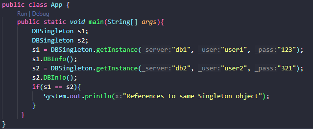
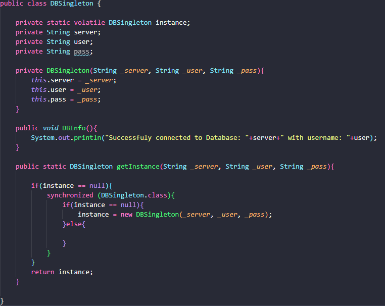

# DIO-Singleton-Database-Connect

 Um exemplo da utilização do Design Pattern Singleton, baseado em uma conexão ficticia com banco de dados.

 ## Chamando o singleton

 Mesmo duas referências diferentes chamando a classe `DBSingleton`, ambas fazem referência a mesma instancia, retornando o mesmo valor, e tornando a classe DBSingleton uma classe de instancia unica.

## Codigo `DBSingleton`

 A classe `DBSingleton` representa uma ficticia conexão com banco de dados.

A função `getInstance` possui uma verificação para saber se uma instância da classe existe, caso seja falso, irá criar a primeira e unica Instância da classe. E caso verifique que outra instacia da classe já exista, irá retornar ela, sem criar uma nova.

